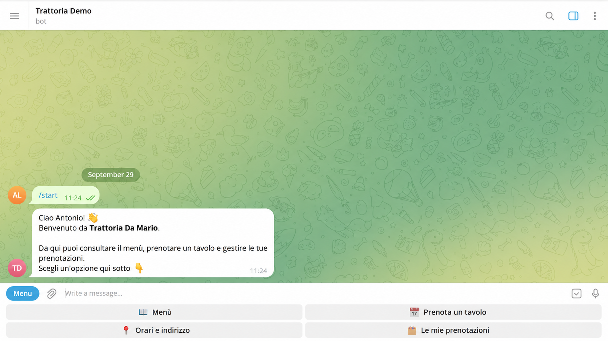
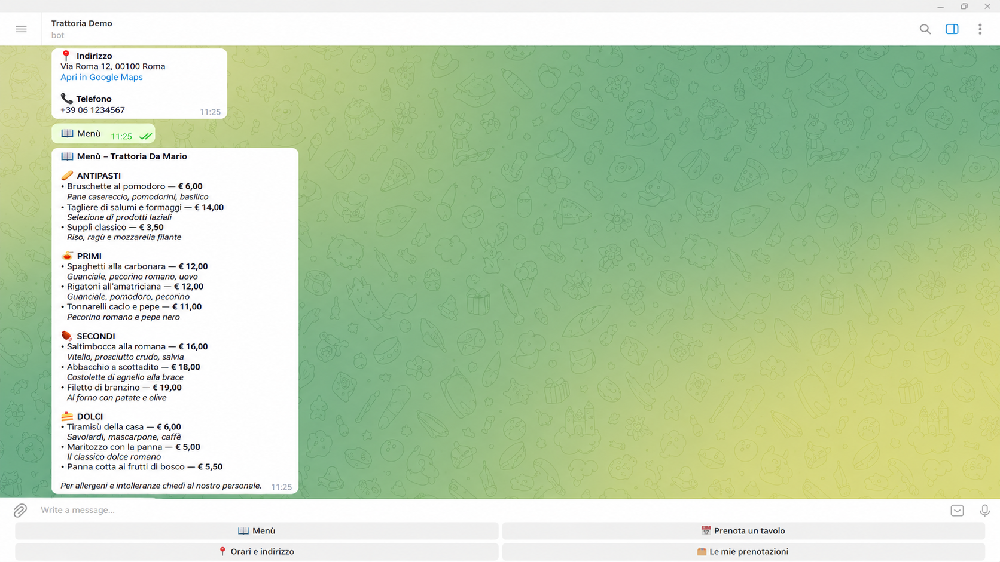
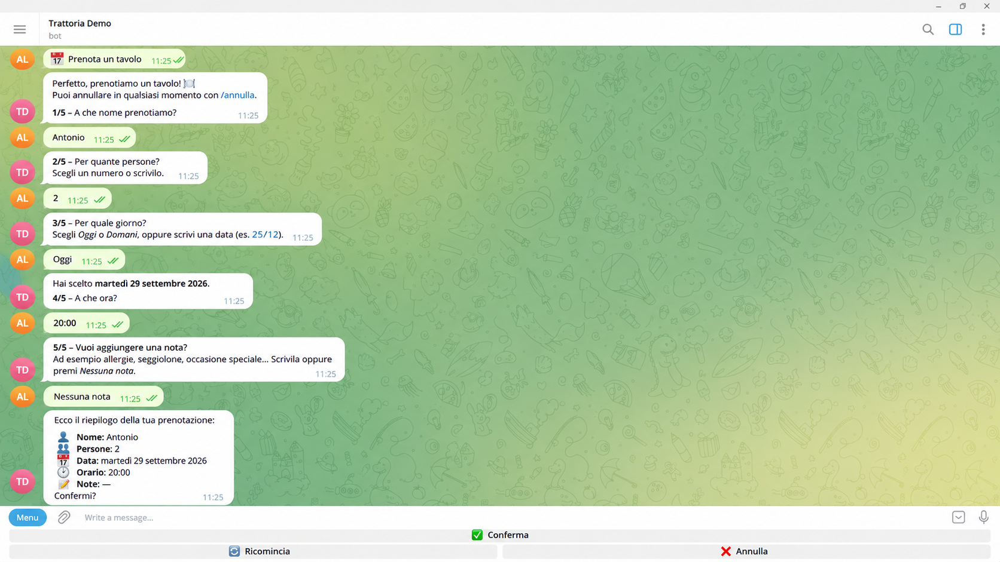
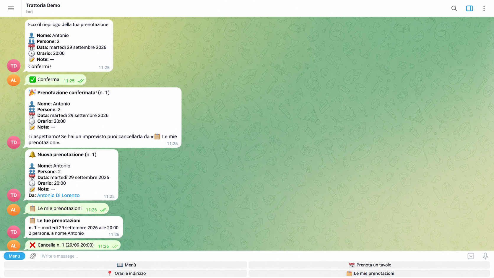

# Restaurant Telegram Bot

A Telegram bot for restaurants: customers can browse the menu, check opening hours and book a table in a few taps. The owner gets a Telegram message for every new or cancelled booking, and has a web dashboard to manage bookings, menu and opening hours.

The bot talks to customers in Italian. Code and docs are in English.

## Features

- **Main menu with buttons**: Menù · Prenota un tavolo · Orari e indirizzo · Le mie prenotazioni
- **Menu** with categories and prices, read from `menu.json` (no code changes needed to edit it)
- **Guided booking** in 5 steps: name → number of people → date (*Oggi*, *Domani* or a typed date like `25/12`) → time slot → notes, then a summary to confirm
  - Rejects past dates, closed days and time slots that have already passed today
  - `/annulla` (or the ❌ button) cancels at any step
- **Owner notifications**: new and cancelled bookings are sent to the owner's chat (`OWNER_CHAT_ID`)
- **`/mioid`** replies with your chat id, so the owner can find theirs
- **Owner-only commands**: `/oggi` (today's bookings) and `/settimana` (next 7 days, grouped by day), both with total covers
- **My bookings**: customers see their upcoming bookings and can cancel them (with a confirmation step)
- **Clear replies to unexpected input**: stickers, photos, random text or unknown commands get a helpful answer instead of silence
- Bookings stored in a local **SQLite** database (`bookings.db`, created automatically)
- **Owner dashboard** (web, works on phones): tonight's covers and room load, next arrivals, the booking register, manual bookings for phone calls, cancellations with undo and a Telegram message to the customer, a menu editor with a live preview of the bot's message, and settings (name, logo, room size, password). See [Owner dashboard](#owner-dashboard)

## Screenshots

| Main menu | Menu | Booking | Owner notification |
|---|---|---|---|
|  |  |  |  |

## Installation

You need Python 3.10+ and a bot token from [@BotFather](https://t.me/BotFather).

```bash
git clone <repo-url> restaurant-telegram-bot && cd restaurant-telegram-bot
python -m venv .venv && source .venv/bin/activate   # Windows: .venv\Scripts\activate
pip install -r requirements.txt
cp .env.example .env                                  # then set TELEGRAM_TOKEN in .env
python bot.py
```

### Setting up owner notifications

1. Start the bot and send it `/mioid` from the owner's Telegram account.
2. Copy the number into `.env` as `OWNER_CHAT_ID=...`.
3. Restart the bot.

The owner must have sent at least one message to the bot, otherwise Telegram does not let the bot write to them.

## Owner dashboard


A small web panel for the restaurant owner, built with FastAPI and plain HTML/CSS. It uses the same `bookings.db` and `menu.json` as the bot, so the two always agree.

- **Header**: logo (or the restaurant name), today's date and the service status ("Servizio serale in corso", "Sala chiusa oggi"...), worked out from the time slots and closed days.
- **Today**: tonight's covers against the room capacity, a summary of what to know (guests with allergies, with children, special occasions, phone bookings), the next 3 arrivals with a countdown, and every arrival in time order with a colour avatar, notes flagged, and an "Adesso" line.
- **Room by time slot**: people seated at each slot and estimated free tables. It assumes each booking takes one table for the average table time set in *Impostazioni*.
- **Live updates**: the home page checks every 5 seconds whether bookings changed (a light JSON request, paused while the tab is hidden). New bookings from the bot appear on their own, flash for a moment and show a notice such as "Nuova prenotazione: Giulia, 20:30, 4 persone"; cancellations made by customers show up too.
- **Next 7 days** grouped by day with total covers, plus a date filter to open any day. Cancelled bookings are folded at the end of the list and shown struck through.
- **Cancel a booking**: the row is struck through with an *Annulla* button; the cancellation is sent after 2 seconds. If the booking came from Telegram, the customer gets a message from the bot; for phone bookings the dashboard reminds you to call. Without JavaScript a confirmation page is used instead.
- **Add a booking by hand**, e.g. for customers who phone. It also appears in the bot's `/oggi` and `/settimana` with a 📞 icon.
- **Menù e orari**: a spreadsheet-like editor for dishes, prices and categories, with a live preview of the bot's menu message, plus opening hours, closed days and bookable time slots. Saved rows flash green. The bot uses the new `menu.json` immediately, with no restart.
- **Impostazioni**: restaurant name, address, phone, logo (PNG, JPG or WebP up to 1 MB), seats, tables, average table time, and the dashboard password.

### Setting the password

Add a password to `.env`:

```
DASHBOARD_PASSWORD=choose-a-long-password
```

The dashboard refuses to start without it (or with the example value `change-me`).

Once logged in, the owner can change the password from **Impostazioni**. The new password is stored hashed in `data/dashboard_settings.json` (git-ignored) and replaces the one in `.env`; every other open session is logged out. To go back to the `.env` password, delete that file.

The uploaded logo is saved in `data/` too.

### Starting it

The dashboard runs separately from the bot. Open a second terminal with the virtual environment active:

```bash
python -m dashboard
```

Then open http://localhost:8000 and log in.

To use it from a phone on the same Wi-Fi, set `DASHBOARD_HOST=0.0.0.0` in `.env` and open `http://<computer-ip>:8000` on the phone. Over the internet, put it behind HTTPS (e.g. a reverse proxy) so the password and the session cookie are encrypted.

## Configuration

### `.env`

| Variable | Required | Description |
|---|---|---|
| `TELEGRAM_TOKEN` | yes | Bot token from @BotFather |
| `OWNER_CHAT_ID` | no | Chat that receives booking notifications |
| `TIMEZONE` | no | Default `Europe/Rome`; used for "today" and past time slots |
| `DASHBOARD_PASSWORD` | for the dashboard | Password to log in to the owner dashboard (until one is set from *Impostazioni*) |
| `DASHBOARD_HOST` | no | Default `127.0.0.1`; `0.0.0.0` to reach it from other devices |
| `DASHBOARD_PORT` | no | Default `8000` |

### Changing the menu

The easiest way is the **Menù e orari** page of the [owner dashboard](#owner-dashboard). You can also edit the `menu` section of `menu.json`. Each category has a name, an emoji and a list of dishes:

```json
{
  "category": "Primi",
  "emoji": "🍝",
  "items": [
    {"name": "Spaghetti alla carbonara", "description": "Guanciale, pecorino, uovo", "price": 12.00}
  ]
}
```

You can add, remove or reorder categories and dishes. `description` can be an empty string. Prices use a dot as the decimal separator (`12.50`); the bot shows them as `€ 12,50`.

**No restart needed**: the file is re-read every time someone opens the menu. If the file contains a JSON error, the bot keeps using the last valid version and logs the error.

### Changing opening hours, address and time slots

Use the dashboard, or edit the `restaurant` section of `menu.json`:

| Field | What it does |
|---|---|
| `name`, `address`, `phone`, `maps_url` | Shown in "Orari e indirizzo" |
| `opening_hours` | List of lines shown to the customer, as free text |
| `closed_weekdays` | Days when booking is not allowed: `0` = Monday … `6` = Sunday |
| `booking_times` | Bookable time slots, in `HH:MM` format |
| `max_people` | Maximum party size for an online booking |
| `capacity`, `tables`, `table_turn_minutes` | Room size and average table time, used by the dashboard's room load |

Tip: check the file with a JSON validator (e.g. jsonlint.com) after editing.

## Project structure

```
bot.py            # Telegram handlers and booking conversation
database.py       # SQLite storage for bookings (shared by bot and dashboard)
dashboard/        # Owner web dashboard (python -m dashboard)
  app.py          #   routes: login, bookings, manual booking, cancel, menu, settings
  menu_editor.py  #   menu and settings form parsing, validation, saving to menu.json
  settings_store.py # password hash, session key and logo (kept in data/)
  templates/      #   Jinja2 HTML templates
  static/         #   style.css, app.js, menu.js, self-hosted font
data/             # Created by the dashboard: settings and logo (git-ignored)
menu.json         # Menu, opening hours, address, time slots, room size
requirements.txt
.env.example      # Template for .env (the real .env is git-ignored)
```

## Commands

| Command | Description |
|---|---|
| `/start` | Main menu |
| `/prenota` | Book a table |
| `/menu` | Show the menu |
| `/info` | Opening hours and address |
| `/prenotazioni` | My bookings |
| `/annulla` | Cancel the booking in progress |
| `/mioid` | Show your chat id |
| `/help` | Help |

### Owner-only commands

These work only in the chat whose id matches `OWNER_CHAT_ID`. Anyone else gets "Questo comando non è disponibile".

| Command | Description |
|---|---|
| `/oggi` | Today's bookings sorted by time, with name, party size, notes and total covers |
| `/settimana` | Bookings for the next 7 days (today included), grouped by day, with total covers per day and for the week |

## Possible extensions

- **WhatsApp version** via the Meta Cloud API, reusing the same booking logic and database
- **More dashboard features**: export bookings to CSV/Excel, statistics on covers and no-shows
- **AI answers to free-text questions** such as allergens, dishes and availability
- **Automatic reminder** sent to the customer the day before the booking
- **Booking form on the restaurant website**, saving to the same database and triggering the same owner notifications
